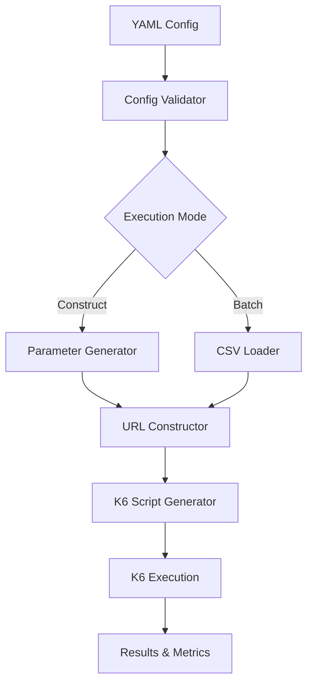

# Synapse

> Dynamic load testing tool using K6 with YAML configuration

Synapse is a powerful command-line tool that generates K6 load testing scripts from simple YAML configurations. It supports dynamic URL construction, multiple parameter types including arrays, CSV data sources, and all K6 features.

## Features

- 🚀 **Dynamic URL Construction** - Build URLs with configurable parameters
- 📊 **Multiple Parameter Types** - Integer, string, array, CSV, and URL parameters
- 🔄 **Batch Mode** - Use pre-built URLs from CSV files
- ⚡ **K6 Integration** - Full K6 feature support with automatic script generation
- 🎯 **Smart Configuration** - Automatic mode detection based on config
- 📈 **Performance Metrics** - Comprehensive load testing results
- 🛠️ **CLI Interface** - Easy-to-use command-line interface

## Quick Start

### Installation

```bash
npm install -g synapse-load-tester
```

### Initialize Configuration

```bash
synapse init --name "My API Test" --url "https://api.example.com"
```

### Run Load Test

```bash
synapse run --config synapse.yml
```

## Architecture Overview



## Parameter Types

Synapse supports multiple parameter types for flexible URL construction:

| Type | Description | Example |
|------|-------------|---------|
| `integer` | Random integers within range | `userId: 1-1000` |
| `string` | Random strings with charset | `sessionId: alphanumeric` |
| `array` | Values from predefined array | `category: [tech, business]` |
| `csv` | Values from CSV file column | `region: regions.csv` |
| `url` | URLs with optional encoding | `encoded URLs` |

## Example Configuration

```yaml
name: "API Load Test"
baseUrl: "https://api.example.com/search"
execution:
  mode: "construct"
  concurrent: 10
  iterations: 100
parameters:
  - name: "query"
    type: "array"
    values: ["javascript", "python", "react"]
  - name: "userId"
    type: "integer"
    min: 1000
    max: 9999
k6Options:
  thresholds:
    http_req_duration: ["p(95)<500"]
```

## Why Synapse?

- **Simplicity** - Define complex load tests with simple YAML
- **Flexibility** - Support for various parameter types and data sources
- **Power** - Full K6 feature compatibility
- **Efficiency** - Automatic script generation and execution
- **Scalability** - Handle large-scale load testing scenarios

Get started with Synapse and transform your load testing workflow!
